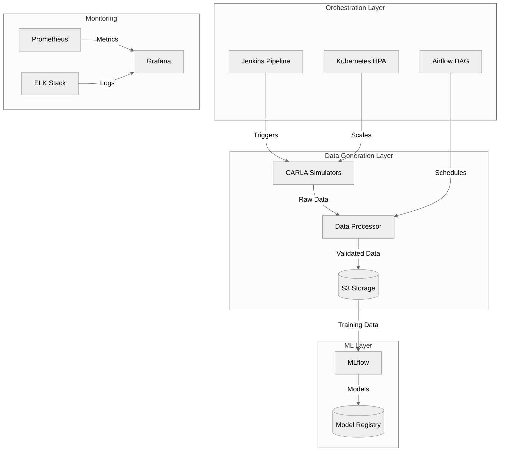

### High-Performance Synthetic Data Generation Pipeline for Autonomous Vehicle Development

**ADAS-CARLA** provides a robust and scalable framework for generating **high-quality synthetic training data** for autonomous driving research.
Built on top of the **CARLA simulator**, it automates large-scale scenario generation and data validation, reducing data collection time from weeks to hours while ensuring **production-level reliability**, **reproducible results**, and **consistent performance** across different environments.

## Key Results
Comming soon

## Architecture Overview



## Quick Start
Comming soon

## Technology Stack

### Infrastructure & Orchestration
- **Cloud:** AWS (EKS, EC2 GPU instances, S3, RDS)  
- **IaC:** Terraform, Ansible  
- **Containerization:** Docker, Kubernetes, Helm  
- **Service Mesh:** Istio  

### Data Pipeline & Processing
- **Simulation:** CARLA 0.9.15  
- **Processing:** Python, OpenCV, Albumentations  
- **Orchestration:** Apache Airflow, Jenkins  
- **Storage:** S3, PostgreSQL, Redis  

### ML / MLOps
- **Tracking:** MLflow  
- **Training:** PyTorch, CUDA  
- **Versioning:** DVC  

### Monitoring & Observability
- **Metrics:** Prometheus, Grafana  
- **Logs:** ELK Stack (Elasticsearch, Logstash, Kibana)  
- **Tracing:** Jaeger  
- **Alerting:** AlertManager, PagerDuty  

---

## Performance Benchmarks
Comming soon

## Project Structure
```
adas-forge/
├── infrastructure/        # IaC (Terraform, Ansible, K8s)
├── src/                   # Application code
│   ├── simulator/         # CARLA integration
│   ├── data_processor/    # Data pipeline
│   ├── ml_pipeline/       # Training pipeline
│   └── api/               # REST API
├── pipelines/             # CI/CD definitions
├── monitoring/            # Observability stack
├── tests/                 # Test suites
└── docs/                  # Documentation
```

---

> Built with ❤️ for the autonomous driving future.